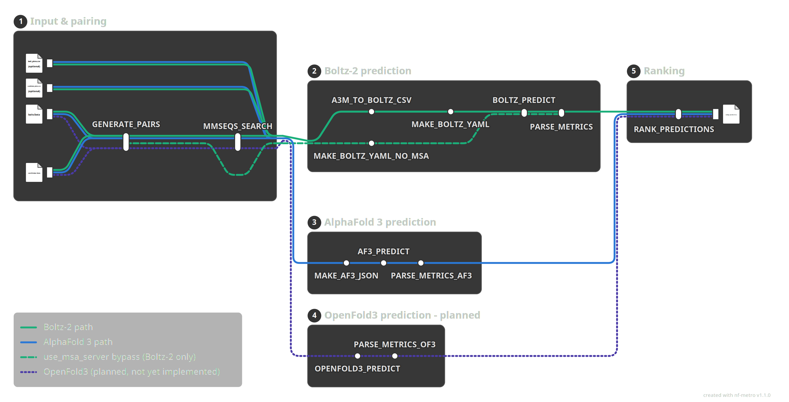

# OmegaPulldown

Structure-based protein–protein interaction screening with [Boltz-2](https://github.com/jwohlwend/boltz) and [AlphaFold 3](https://github.com/google-deepmind/alphafold3).

Analogous to [AlphaPulldown](https://github.com/KosinskiLab/AlphaPulldown) (Yu et al., *Bioinformatics* 2023) but built on a Nextflow pipeline that runs Boltz-2 and AlphaFold 3, two next-generation predictors with native PTM support, under a single ranking schema.



## Features

- **Bait × candidate screening** — one-vs-many or many-vs-many, from two FASTA files
- **Dual backend** — Boltz-2 and AlphaFold 3, selectable with `--predictor boltz2 | alphafold3`
- **Post-translational modifications** — specified via a simple CSV using CCD codes (e.g., NAG, SEP, TPO)
- **MSA caching** — pre-computed A3M files are reused across pairs and across runs; MMSEQS_SEARCH is skipped for proteins with cached alignments
- **Unified ranking** — ipTM, pTM, pDockQ, and pLDDT reported in a single TSV for either backend

## Pipeline stages

1. **GENERATE_PAIRS** — enumerate bait × candidate combinations
2. **MMSEQS_SEARCH** — compute MSAs per unique protein via mmseqs2 (skipped if pre-computed)
3. **Input assembly** — A3M → Boltz-2 CSV or AF3 JSON with cleaned/patched MSAs
4. **Structure prediction** — BOLTZ_PREDICT or AF3_PREDICT (GPU)
5. **PARSE_METRICS** — extract confidence scores and compute pDockQ per pair
6. **RANK_PREDICTIONS** — aggregate and rank all pairs into a single TSV

## Quick start

```bash
# Boltz-2 on a Slurm cluster
nextflow run main.nf -profile slurm \
  --baits_fasta inputs/sequences/baits.fasta \
  --candidates_fasta inputs/sequences/candidates.fasta \
  --mmseqs_db /path/to/uniref90

# AlphaFold 3
nextflow run main.nf -profile slurm \
  --predictor alphafold3 \
  --baits_fasta inputs/sequences/baits.fasta \
  --candidates_fasta inputs/sequences/candidates.fasta

# With pre-computed MSAs (skips MMSEQS_SEARCH)
nextflow run main.nf -profile slurm \
  --alignments_dir results/alignments
```

The `-profile slurm` flag is required for GPU-accelerated prediction on HPC clusters. Without it, Nextflow runs locally and predictions will fail if no GPU is available.

## Profiles

| Profile | Description |
|---------|-------------|
| `standard` | Local execution (default) |
| `slurm` | Slurm scheduler with GPU partitions |
| `sge` | Sun Grid Engine |
| `test` | Quick test with reduced sampling steps |

## Post-translational modifications

Place a CSV file alongside each FASTA (e.g., `bait_ptms.csv` next to `baits.fasta`), or specify paths with `--bait_ptms` and `--candidate_ptms`:

```csv
protein_id,position,ccd
MyProtein,84,SEP
MyProtein,142,NAG
```

Codes follow the [RCSB PDB Chemical Component Dictionary](https://www.rcsb.org/ligand).

## Sampling strategy

- **Boltz-2**: 5 diffusion samples per prediction. Boltz-2 uses conditional flow matching, which preserves structural diversity across samples.
- **AlphaFold 3**: 5 seeds × 1 diffusion sample. Within-seed samples show very narrow variance in practice, so seed-to-seed variation (independent MSA subsampling and trunk computation) better captures prediction uncertainty.

## Repository structure

```
OmegaPulldown/
├── main.nf                 # Pipeline entry point
├── nextflow.config         # Parameters and profiles
├── modules/
│   ├── search_msa.nf       # MMSEQS_SEARCH, A3M_TO_BOLTZ_CSV
│   ├── prepare_input.nf    # GENERATE_PAIRS, MAKE_BOLTZ_YAML
│   ├── predict.nf          # BOLTZ_PREDICT
│   ├── predict_af3.nf      # MAKE_AF3_JSON, AF3_PREDICT
│   ├── rank.nf             # PARSE_METRICS, RANK_PREDICTIONS
│   └── rank_af3.nf         # PARSE_METRICS_AF3
├── bin/
│   └── make_af3_json.py    # AF3 JSON builder with A3M cleaning
├── inputs/
│   └── sequences/          # FASTA files and PTM CSVs
├── extras/
│   └── pipeline_subway.png # Pipeline schematic
└── results/                # Output (not tracked in git)
```

## Requirements

- [Nextflow](https://www.nextflow.io/) ≥ 22.10
- [mmseqs2](https://github.com/soedinglab/MMseqs2) (for local MSA computation)
- [Boltz-2](https://github.com/jwohlwend/boltz) (conda environment)
- [AlphaFold 3](https://github.com/google-deepmind/alphafold3) (Singularity container). Model weights require a [license agreement with Google DeepMind](https://github.com/google-deepmind/alphafold3/blob/main/WEIGHTS_TERMS_OF_USE.md) and should be stored in each user's own directory (set `af3_model_dir` in `nextflow.config`).
- Python 3.9+ with numpy

## Local setup

The shipped `nextflow.config` contains placeholder paths for the conda environment, mmseqs2 database, and AlphaFold 3 container/databases. If you are authorized to use the Whitehead Institute computing resources, contact [Troy](https://github.com/t-whitfield) for the pre-configured local paths.

## References

- Yu D, Chojnowski G, Rosenthal M, Kosinski J. AlphaPulldown — a python package for protein–protein interaction screens using AlphaFold-Multimer. *Bioinformatics* 2023;39(1):btac749.
- Passaro S et al. Boltz-2: Exploring the frontiers of biomolecular structure prediction. *bioRxiv* 2025. DOI:10.1101/2025.06.14.659707.
- Abramson J et al. Accurate structure prediction of biomolecular interactions with AlphaFold 3. *Nature* 2024;630:493–500.
